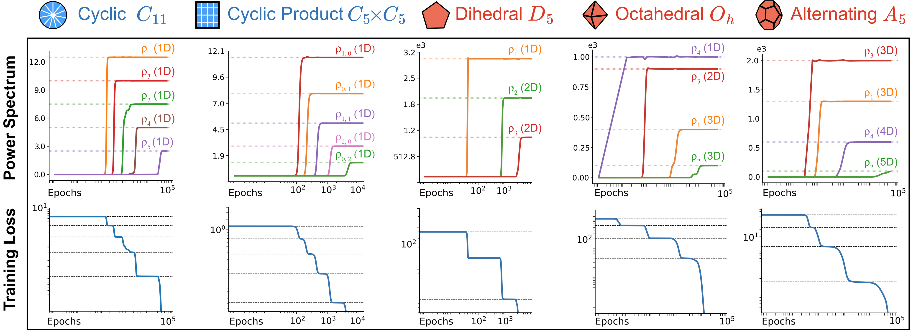

<h1 align="center">Sequential Group Composition</h1>

<h3 align="center">A Window into the Mechanics of Deep Learning</h3>

<p align="center">
  <a href="https://arxiv.org/abs/2602.03655"></a>
  <a href="https://github.com/geometric-intelligence/group-agf/actions/workflows/ci.yml"></a>
  <a href="https://opensource.org/licenses/MIT"></a>
</p>

<p align="center">
  <a href="https://arxiv.org/abs/2602.03655">Paper</a> &bull;
  <a href="https://arxiv.org/pdf/2602.03655">PDF</a> &bull;
  <a href="#installation">Install</a> &bull;
  <a href="#usage">Usage</a> &bull;
  <a href="#citation">Citation</a>
</p>

<p align="center">
  <b>Giovanni Luca Marchetti &middot; Daniel Kunin &middot; Adele Myers &middot; Francisco Acosta &middot; Nina Miolane</b>
</p>

---

> **How do neural networks trained over sequences acquire the ability to perform structured operations, such as arithmetic, geometric, and algorithmic computation?**
>
> We introduce the *sequential group composition* task: networks receive a sequence of elements from a finite group encoded in a real vector space and must predict their cumulative product. We prove that two-layer networks learn this task **one irreducible representation at a time**, in an order determined by the Fourier statistics of the encoding -- producing a characteristic *staircase* in the training loss.

<p align="center">
  
</p>
<p align="center">
  <em><b>Two-layer networks learn group composition one irreducible representation at a time.</b> Top: power spectrum of the learned function over training. Bottom: training loss showing a characteristic staircase. Each column is a different finite group.</em>
</p>

---

## Installation

### Prerequisites

- [Conda](https://docs.conda.io/en/latest/) (Miniconda or Anaconda)
- `gfortran` (Linux only, required by some numerical dependencies)

### Setup

```bash
# Linux only: install gfortran
sudo apt install -y gfortran

# Create and activate the conda environment
conda env create -f conda.yaml
conda activate group-agf

# Install all Python dependencies (pinned versions from poetry.lock)
poetry install
```

## Usage

### Single Run

Train a model on a specific group:

```bash
python src/main.py --config src/config_d3.yaml
```

Results (loss curves, predictions, power spectra) are saved to a timestamped directory under `runs/`.

### Supported Groups

The repository includes preconfigured experiments for five groups:

| Group | Config | Order | Architecture |
|:------|:-------|:-----:|:-------------|
| Cyclic \( C_{10} \) | `src/config_c10.yaml` | 10 | QuadraticRNN |
| Product \( C_4 \times C_4 \) | `src/config_c4x4.yaml` | 16 | QuadraticRNN |
| Dihedral \( D_3 \) | `src/config_d3.yaml` | 6 | TwoLayerNet |
| Octahedral | `src/config_octahedral.yaml` | 24 | TwoLayerNet |
| Icosahedral \( A_5 \) | `src/config_a5.yaml` | 60 | TwoLayerNet |

### Parameter Sweeps

Run experiments across multiple configurations and random seeds:

```bash
python src/run_sweep.py --sweep src/sweep_configs/example_sweep.yaml
```

Multi-GPU support:

```bash
# Auto-detect and use all available GPUs
python src/run_sweep.py --sweep src/sweep_configs/example_sweep.yaml --gpus auto

# Use specific GPUs
python src/run_sweep.py --sweep src/sweep_configs/example_sweep.yaml --gpus 0,1,2,3
```

Sweep results are saved to `sweeps/{sweep_name}_{timestamp}/` with per-seed results and aggregated summaries.

## Configuration

Key parameters in the YAML config files:

| Parameter | Options | Description |
|:----------|:--------|:------------|
| `data.group_name` | `cn`, `cnxcn`, `dihedral`, `octahedral`, `A5` | Group to learn |
| `data.k` | integer | Number of elements to compose |
| `data.template_type` | `mnist`, `fourier`, `gaussian`, `onehot`, `custom_fourier` | Template generation method |
| `model.model_type` | `QuadraticRNN`, `SequentialMLP`, `TwoLayerNet` | Architecture |
| `model.hidden_dim` | integer | Hidden layer size |
| `model.init_scale` | float | Weight initialization scale |
| `training.optimizer` | `auto`, `adam`, `per_neuron`, `hybrid` | Optimizer (`auto` recommended) |
| `training.learning_rate` | float | Base learning rate |
| `training.mode` | `online`, `offline` | Training mode |
| `training.epochs` | integer | Number of epochs (offline mode) |

<details>
<summary><b>Example config -- D3 with custom Fourier template</b></summary>

```yaml
data:
  group_name: dihedral
  group_n: 3
  k: 2
  template_type: custom_fourier
  powers: [0.0, 30.0, 3000.0]

model:
  model_type: TwoLayerNet
  hidden_dim: 180
  init_scale: 0.001

training:
  optimizer: per_neuron
  learning_rate: 0.01
  mode: offline
  epochs: 2000
```

</details>

## Repository Structure

```
group-agf/
├── src/                          # Source code
│   ├── main.py                   # Training entry point (CLI)
│   ├── model.py                  # TwoLayerNet, QuadraticRNN, SequentialMLP
│   ├── optimizer.py              # PerNeuronScaledSGD, HybridRNNOptimizer
│   ├── dataset.py                # Dataset generation and loading
│   ├── template.py               # Template construction functions
│   ├── fourier.py                # Group Fourier transforms
│   ├── power.py                  # Power spectrum computation
│   ├── viz.py                    # Plotting and visualization
│   ├── train.py                  # Training loops (offline and online)
│   ├── run_sweep.py              # Parameter sweep runner
│   └── config_*.yaml             # Group-specific configurations
├── test/                         # Unit and integration tests
├── notebooks/                    # Jupyter notebooks for exploration
├── pyproject.toml                # Project metadata and dependencies
├── poetry.lock                   # Pinned dependency versions
└── conda.yaml                    # Conda environment specification
```

<details>
<summary><b>Module details</b></summary>

### `model.py` -- Neural Network Architectures

| Model | Description | Input |
|:------|:------------|:------|
| **TwoLayerNet** | Two-layer feedforward network with configurable nonlinearity (square, relu, tanh, gelu) | Flattened binary pair `(N, 2 * group_size)` |
| **QuadraticRNN** | Recurrent network: `h_t = (W_mix h_{t-1} + W_drive x_t)^2` | Sequence `(N, k, p)` |
| **SequentialMLP** | Feedforward MLP with k-th power activation, permutation-invariant for commutative groups | Sequence `(N, k, p)` |

### `optimizer.py` -- Custom Optimizers

| Optimizer | Description | Recommended for |
|:----------|:------------|:----------------|
| **PerNeuronScaledSGD** | SGD with per-neuron learning rate scaling exploiting model homogeneity | SequentialMLP, TwoLayerNet |
| **HybridRNNOptimizer** | Scaled SGD for MLP weights + Adam for recurrent weights | QuadraticRNN |
| Adam (PyTorch built-in) | Standard Adam | QuadraticRNN |

### `dataset.py` -- Data Generation

- **Online datasets**: `OnlineModularAdditionDataset1D`, `OnlineModularAdditionDataset2D` -- generate samples on-the-fly (GPU-accelerated)
- **Offline builders**: `build_modular_addition_sequence_dataset_1d`, `_2d`, `_D3`, `_generic`
- **Group datasets**: `cn_dataset`, `cnxcn_dataset`, `group_dataset` -- full group multiplication tables for TwoLayerNet

### `template.py` -- Template Construction

- **Group templates**: `one_hot`, `fixed_cn`, `fixed_cnxcn`, `fixed_group`
- **1D synthetic**: `fourier_1d`, `gaussian_1d`, `onehot_1d`
- **2D synthetic**: `gaussian_mixture_2d`, `unique_freqs_2d`, `fixed_2d`, `hexagon_tie_2d`, `ring_isotropic_2d`, `gaussian_2d`
- **MNIST-based**: `mnist`, `mnist_1d`, `mnist_2d`

### `fourier.py` -- Group Fourier Transforms

- `group_fourier(group, template)` -- Fourier coefficients via irreducible representations
- `group_fourier_inverse(group, fourier_coefs)` -- reconstruct template from Fourier coefficients

### `power.py` -- Power Spectrum Analysis

- `GroupPower` -- power spectrum of a template over any `escnn` group
- `CyclicPower` -- specialized for cyclic groups via FFT
- `model_power_over_time` -- track how the model's learned power spectrum evolves during training
- `theoretical_loss_levels_1d`, `_2d` -- predict staircase loss plateaus from template power

### `viz.py` -- Visualization

Plotting functions for training analysis: `plot_train_loss_with_theory`, `plot_predictions_1d`, `plot_predictions_2d`, `plot_predictions_group`, `plot_power_1d`, `plot_power_group`, `plot_wmix_structure`, `plot_irreps`, and more.

### `train.py` -- Training Loops

- `train(model, loader, criterion, optimizer, ...)` -- epoch-based offline training
- `train_online(model, loader, criterion, optimizer, ...)` -- step-based online training

</details>

## Testing

```bash
# Unit tests
pytest test/ --ignore=test/test_notebooks.py -v

# Integration tests (fast mode)
MAIN_TEST_MODE=1 pytest test/test_main.py -v
```

## Development

```bash
# Install pre-commit hooks
pre-commit install

# Run linting
ruff check .
ruff format --check .
```

## Citation

If you find this work useful, please cite:

```bibtex
@article{marchetti2026sequential,
  title   = {Sequential Group Composition: A Window into the Mechanics of Deep Learning},
  author  = {Marchetti, Giovanni Luca and Kunin, Daniel and Myers, Adele and Acosta, Francisco and Miolane, Nina},
  journal = {arXiv preprint arXiv:2602.03655},
  year    = {2026}
}
```

## License

This project is licensed under the MIT License. See [LICENSE](LICENSE) for details.
